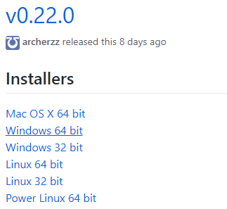
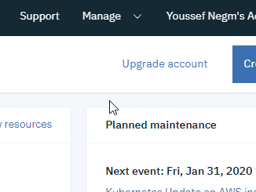
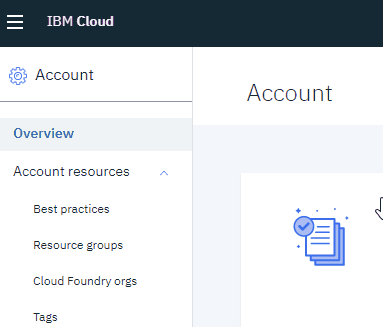
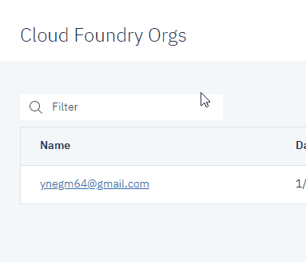
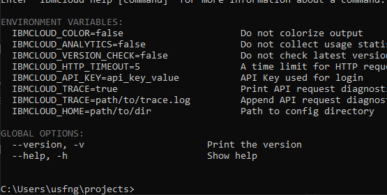
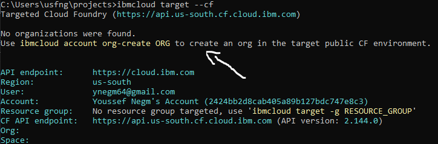
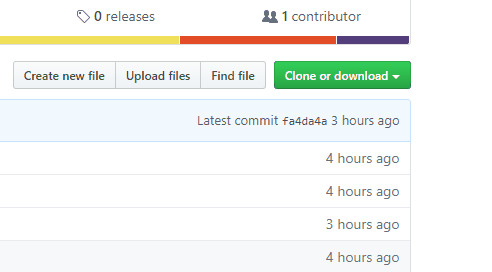
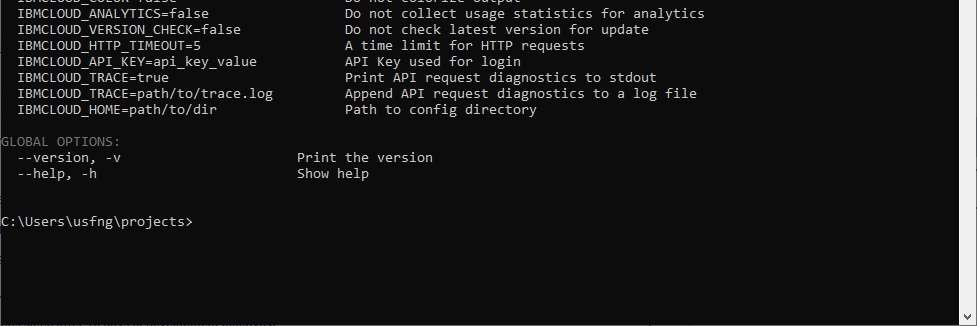
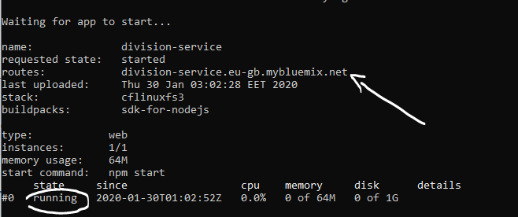
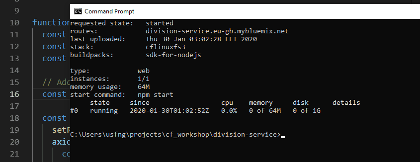

# IBM Cloud Foundry Simple Example

**Disclaimer:** *This is not an official IBM github repository. This is a personal repository used for demo/workhsop purposes.*

This demo is intented to showcase IBM CF and walk you through the process of deploying a simple cloud-native application on the cloud. It also showcases some of the CF features like: self-healing & scaling. The dmeo app is a very basic calculator that can only divide two numbers and return the result through a web based UI. The app consists of two main components:

1. **A ReactJS frontend *(Located in the [calculator-ui](https://github.com/usfngm/cf_workshop/tree/master/calculator-ui) folder)*:** This component serves the UI and has the code that sends the HTTP request to the NodeJS backend and finally show the result of the division into a textbox.
2. **A NodeJS backend  *(Located in the [division-service](https://github.com/usfngm/cf_workshop/tree/master/division-service) folder)*:** This component has the division logic and recieves HTTP requests from clients and responds back with the result in JSON format.
<!-- https://github.com/usfngm/cf_workshop/blob/master/imgs/img_1.png -->

  

# Table of Contents
1. [Overview](#ibm-cloud-foundry-simple-example)
2. [Prerequisites](#Prerequisites)
3. [Instructions](#Instructions)
    * [3.1 Preparing the IBM Cloud CLI for deployment](#3.1-Preparing-the-IBM-Cloud-CLI-for-deployment)
    * [3.2 Logging into IBM Cloud CLI](#3.2-Logging-into-IBM-Cloud-CLI)
    * [3.3 Downloading the code on your machine](#3.3-Downloading-the-code-on-your-machine)
4. test

# 2. Prerequisites
1. An IBM Account. You can get one [here](https://ibm.biz/BdqBhv)
2. IBM Cloud Command Line Interface (CLI) from [here](https://github.com/IBM-Cloud/ibm-cloud-cli-release/releases/)

   *Under installers, pick your OS along with the correct architecture (32bit/64bit)*

     
   **Note:** *The latest version might differ from the one in the image above*

 3. Any code editor of your choice.

 4. Very basic knowlege of Command Line *(ex. navigation and running simple commands)*

 # 3. Instructions

**Note:** *Make sure you have all the prerequisites from above before starting with the instructions below*

## 3.1 Preparing the IBM Cloud CLI for deployment

Before logging into the IBM Cloud CLI, we need to know which region does our Cloud Foundry organization reside in. To know that, follow the steps below:

*Why? Because if we logged in to a different region than our Cloud Foundry org, our CLI won't be able to see or interact with Cloud Foundry. To learn more about IBM Cloud Orgs & spaces, [click here](https://cloud.ibm.com/docs/account?topic=account-orgsspacesusers#cf-org-concepts)*

1. Navigate to https://cloud.ibm.com/ & Login with your account

2. In the IBM Cloud dashboard menu bar at they top, click on **Manage** then **Account** 
   

  

3. In the Account mangement page, under **Account Resources** click **Cloud Foundry Orgs**

  

4. You will find a list of Cloud Foundry Orgs (usually there will only one when you create your account), click on it and it should reveal the org region. You can see here below that my region is in the UK

  

5. Now that we know our CF org region, we can login into the IBM Cloud CLI

## 3.2 Logging into IBM Cloud CLI
To login in IBM Cloud CLI, use the following command

    ibmcloud login -r <region-code>
 
For example, my region above were the UK, so I used the following command to login

    ibmcloud login -r eu-gb
 
To know which code region to use while logging in, we can write the following command in the terminal

    ibmcloud regions
 
Check the gif below for reference

  

 
After logging in successfully make sure to run the following command to make your cloud CLI target the IBM Cloud Foundry

    ibmcloud target --cf
 
If you get the following error make sure you are in the correct region as explained above:

  

 
If everything went smoothly you should see something like this

  

Now you are ready to deploy apps to **Cloud Foundry** on **IBM Cloud**
 

## 3.3 Downloading the code on your machine
If you have git installed on your machine and you are comfortable with the command line, clone this repo anywhere on your computer by using the following command:

    git clone https://github.com/usfngm/cf_workshop
 
If you don't have git or you'd rather not use the command line, click the green 'clone or download' button at the top of this page then click on 'Download Zip' as shown in the gif below:

  

 
Extract the zip file anywhere you like. But don't forget where you unzipped it because we will need to navigate to this path using the command line for the next step.

Now that we have the code on our machine, we are ready for the final step which is to finally deploy our application on IBM Cloud Foundry
 

## 3.4 Deploying our apps on IBM Cloud Foundry

In this step, we will deploy the backend first in order to get its url and plug it in the front end then deploy it as well.

To deploy the backend, open your command line and navigate to the [division-service](https://github.com/usfngm/cf_workshop/tree/master/division-service) folder

Write the following command while inside the division-service folder:

    ibmcloud cf push -m 64m <app name>

*Note: the -m flag specifies the allocated memory for the application. By default cf allocates 1GB per deployment, but this is beyond the limit of the IBM Cloud Free Account, so we have to specify this memory flag otherwise, we'll get an error in deployment.*

Make sure to choose a unique app name because it's gonna be a part of the app's url

Check the following gif for reference:

  

 
Notice the url of your app appears at the end after successfully deploying the app (see img below)

  

Take note of that url as we will need to feed it to the front end in the next step

To edit the frontend code, open your favourite text editor and open the file named **App.js** inside the following path

    cf_workshop/calculator-ui/src/App.js
 
Copy the url of the division-service app we deployed in the previous step and put it inside the App.js file on line 16 as shown in the below gif: 

  

*Note: If for some reason you lost the app's url and you want to get it again you can visit your account's [resource list](https://cloud.ibm.com/resources) and you will be able to see all your CF apps and thier URLs under **Cloud Foundry Apps**. Another solution is to write the following command on the command line:*

    ibmcloud cf apps

This will give you a list of all yours app and their URLs as well.

 

Now after editing your **App.js** file, save it and you are ready to deploy your front end.
Navigate to the [calculator-ui](https://github.com/usfngm/cf_workshop/tree/master/calculator-ui) folder inside your command line and run the deploy command again

    ibmcloud cf push -m 64m <app name>